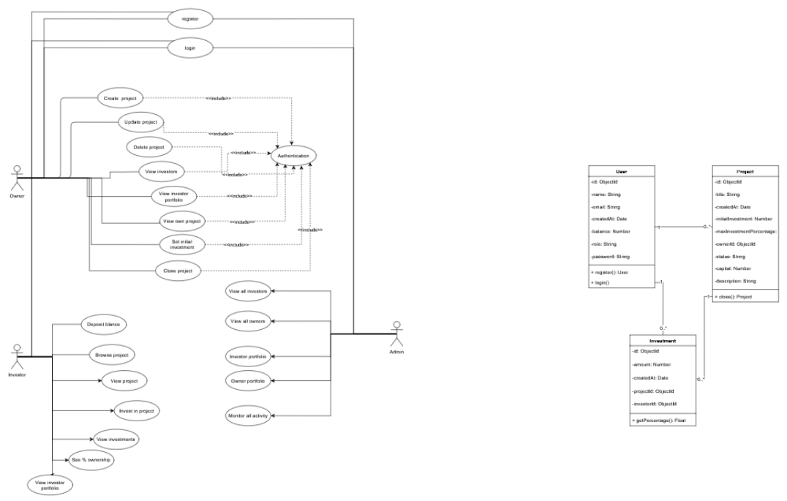
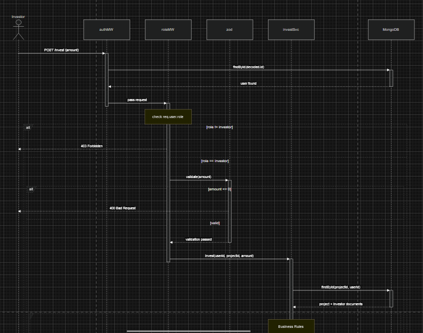

# 🚀 Crowdfunding Platform API

A secure backend API built with **Node.js, Express, and MongoDB** that allows project owners to raise funds and investors to contribute financially.

---

## 📌 Overview

This platform connects **project owners** with **investors** and enables:

- Creating and managing funding projects
- Investing in projects
- Tracking contributions and funding progress
- Applying business rules (investment limits, auto-closing projects)
- Managing user portfolios
- Admin monitoring

---

## 🛠️ Technologies

- Node.js
- Express.js
- MongoDB + Mongoose
- JWT (Authentication)
- bcrypt (Password hashing)
- Joi (Validation)
- Swagger (API Documentation)
- Docker (Containerization)

---

## 👥 Roles

### 🧑‍💼 Project Owner
- Create projects
- Update/Delete projects
- View investors
- Close project manually

### 💰 Investor
- Deposit balance
- View projects
- Invest in projects
- Track investments

### 🛡️ Admin
- View all users
- Monitor platform activity
- Access user portfolios

---

## 🧱 Data Models

### User
- name
- email
- password (hashed)
- role (owner | investor | admin)
- balance

### Project
- title
- description
- capital
- status (open | closed)
- ownerId
- maxInvestmentPercentage
- initialInvestment

### Investment
- amount
- investorId
- projectId

---

## ⚙️ Business Rules

- Max 50% investment per investor
- Cannot exceed remaining capital
- Only open projects accept investments
- Project closes automatically when capital is reached
- Closed projects cannot accept investments

---

## 🔐 Authentication

JWT-based authentication.

Example header:

Authorization: Bearer TOKEN


---

## 📡 API Endpoints

### Auth
| Method | Endpoint |
|--------|---------|
| POST | /api/auth/register |
| POST | /api/auth/login |

### Projects
| Method | Endpoint |
|--------|---------|
| POST | /api/projects |
| GET | /api/projects |
| PUT | /api/projects/:id |
| DELETE | /api/projects/:id |
| PATCH | /api/projects/:id/close |

### Investments
| Method | Endpoint |
|--------|---------|
| POST | /api/projects/:id/invest |
| GET | /api/investments/my |

### Admin
| Method | Endpoint |
|--------|---------|
| GET | /api/admin/users |

---

## 📄 API Documentation (Swagger)

Access Swagger UI:
http://localhost:1010/api-docs


---

## 🐳 Docker Setup

### 📦 Build & Run

```bash
docker compose up --build

📍 Services
API → http://localhost:1010
Swagger → http://localhost:1010/api-docs
MongoDB → port 27017
🛑 Stop

```Bash
docker compose down

```


⚙️ Environment Variables

Create a .env file:

PORT=1010
MONGO_URI=mongodb://mongo:27017/crowdfunder
JWT_SECRET=your_secret_key


```
src/
├── app.js
├── server.js
├── config/
│   ├── db.js
│   └── swagger.js
├── models/
│   ├── User.js
│   ├── Project.js
│   └── Investment.js
├── routes/
│   ├── auth.routes.js
│   ├── project.routes.js
│   └── user.routes.js
├── controllers/
├── services/
├── middlewares/
│   ├── auth.middleware.js
│   ├── role.middleware.js
│   ├── ownership.middleware.js
│   ├── validateRequest.js
│   ├── errorHandler.js
│   └── notFound.js
```


🧪 Health Check
```
GET /health
```

Response:

```
{
  "success": true,
  "message": "server is running"
}
```

----

## UML Diagrams

The project documentation includes:

- Use Case Diagram
- Class Diagram
- Sequence Diagram


# UML Diagrams

## Use Case Diagram
## Class Diagram



## Sequence Diagram


